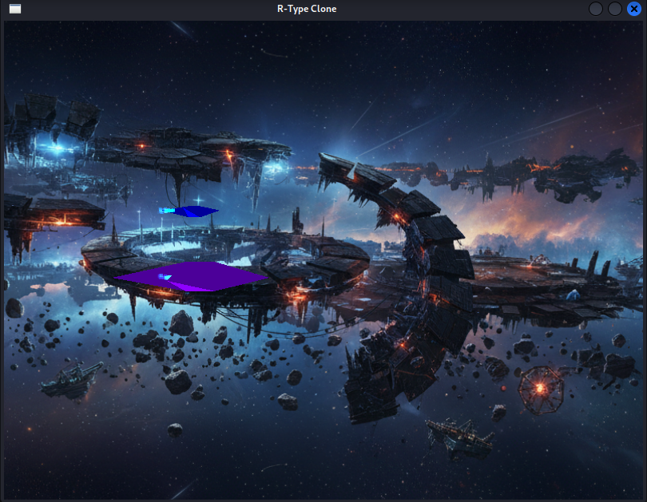

# 🚀 R-Type Clone

[](https://isocpp.org/)
[](https://cmake.org/)
[](LICENSE)

A modular, cross-platform game engine prototype featuring a classic R-Type style space shooter. Built with a dynamic module architecture using ZeroMQ for inter-module communication.

<p align="center">
  
</p>

---

## 📖 Table of Contents

- [Features](#-features)
- [Quick Start](#-quick-start)
- [Documentation](#-documentation)
- [Project Structure](#-project-structure)
- [License](#-license)

---

## ✨ Features

- **Modular Architecture**: Dynamic module loading with isolated subsystems
- **Cross-Platform**: Supports Linux and Windows
- **Multiplayer**: Server-authoritative networking with client prediction
- **Lua Scripting**: Game logic powered by Lua/Sol2 ECS
- **3D Rendering**: OpenGL-based renderer with SFML window management
- **Physics**: Bullet3 physics engine integration
- **Sound**: SFML-based audio system with music and effects

---

## 🚀 Quick Start

### Prerequisites

- Git
- CMake (≥ 3.15)
- C++17 compiler (GCC/Clang on Linux, MSVC on Windows)
- vcpkg (included as submodule)

### Build & Run

```bash
# Clone the repository
git clone --recursive https://github.com/thinkboosted/R-type-Clone.git
cd R-type-Clone

# Build using the helper script
python3 build.py

# Run the game
cd build
./r-type_client local              # Solo mode
./r-type_server 4242 &             # Start server (multiplayer)
./r-type_client 127.0.0.1 4242     # Connect as client
```

For detailed build instructions, see [📦 Installation Guide](docs/INSTALL.md).

---

## 📚 Documentation

| Document | Description |
|----------|-------------|
| [📦 Installation Guide](docs/INSTALL.md) | Complete build instructions for Linux & Windows |
| [🤝 Contributing Guide](docs/CONTRIBUTING.md) | How to contribute to the project |
| [🏗️ Architecture Overview](docs/ARCHITECTURE.md) | Engine architecture and module system |
| [📡 Network Protocol](docs/NETWORK_PROTOCOL.md) | Client-server communication protocol |
| [📨 Message Channels](docs/CHANNELS.md) | ECS pub/sub channel reference |
| [📖 API Reference](docs/api/index.html) | Doxygen-generated API documentation |

---

## 📁 Project Structure

```
R-type-Clone/
├── src/
│   ├── engine/              # Core engine code
│   │   ├── app/             # Application base classes
│   │   ├── modules/         # Dynamic modules (Renderer, Sound, Physics, etc.)
│   │   └── modulesManager/  # Module loading and lifecycle
│   └── game/                # R-Type game implementation
│       ├── client/          # Client application
│       └── server/          # Server application
├── assets/
│   ├── scripts/             # Lua game scripts
│   │   └── space-shooter/   # Main game logic
│   ├── textures/            # Game textures
│   ├── models/              # 3D models
│   └── sounds/              # Audio files
├── docs/                    # Documentation
├── cmake/                   # CMake modules
└── vcpkg.json               # vcpkg dependencies manifest
```

---

## 🎮 Controls

| Key | Action |
|-----|--------|
| `W` / `↑` | Move Up |
| `S` / `↓` | Move Down |
| `A` / `←` | Move Left |
| `D` / `→` | Move Right |
| `SPACE` | Shoot |
| `ESC` | Pause Menu |

---

## 🛠️ Dependencies

Managed via vcpkg:

- **SFML** - Window management and audio
- **GLEW** - OpenGL extension loading
- **ZeroMQ / cppzmq** - Inter-module messaging
- **Lua / Sol2** - Scripting engine
- **Bullet3** - Physics simulation
- **Asio** - Networking
- **MsgPack** - Binary serialization
- **Google Test** - Unit testing

---

## 📄 License

This project is licensed under the MIT License - see the [LICENSE](LICENSE) file for details.

---

## 🙏 Acknowledgments

- Original R-Type game by Irem
- EPITECH for the project specification
