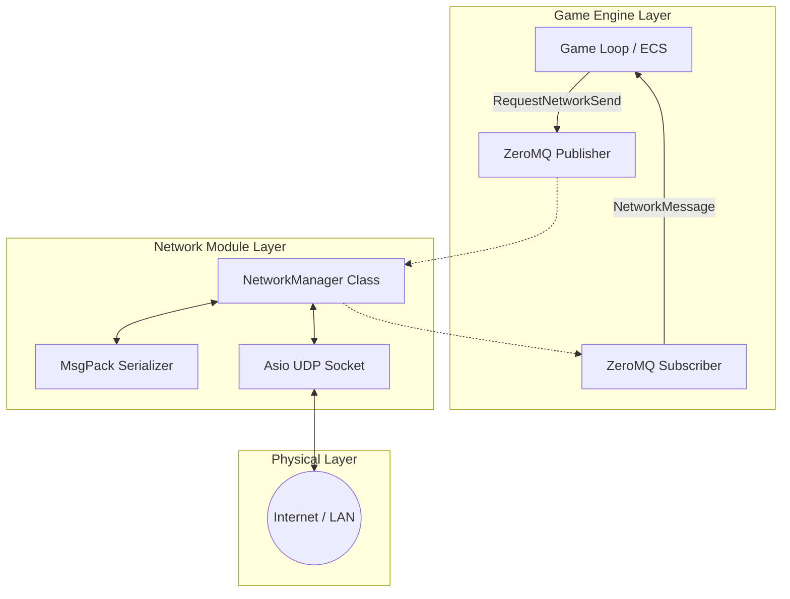
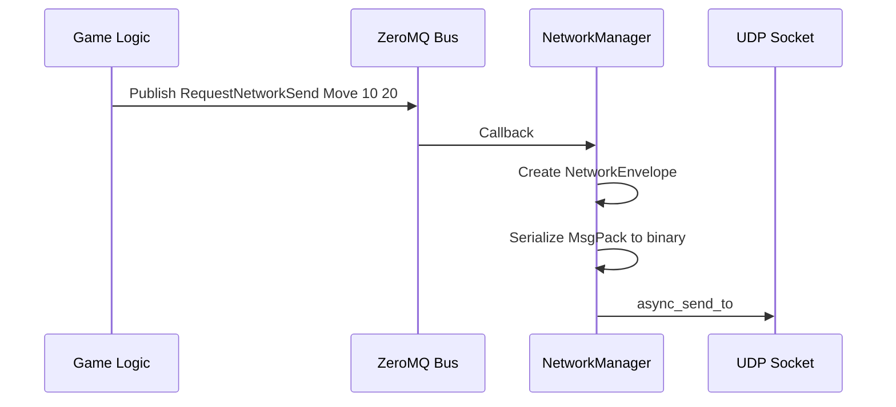
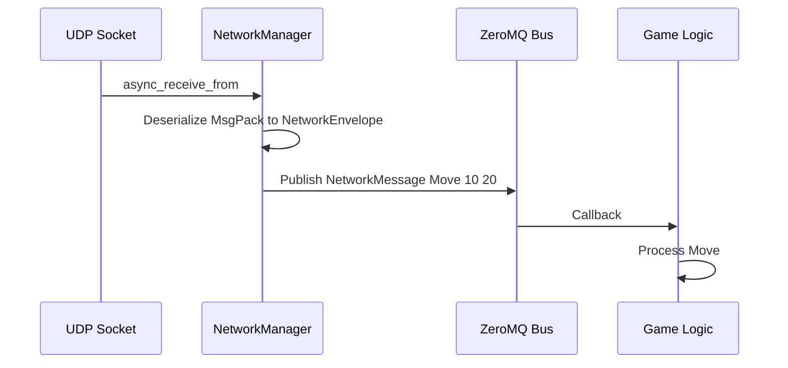

# 🌐 NetworkManager Architecture


The **NetworkManager** module is the backbone of the R-Type project communications. It ensures fast, asynchronous data transport between the Server and Clients.

> **Important:** The NetworkManager is a **pure network abstraction** - it handles sockets only, with NO client/server game logic. Game logic (lobbies, player management, game state) must be implemented in a separate layer.

**Related Documentation:**
- [📡 Network Protocol](NETWORK_PROTOCOL.md) - Wire protocol specification
- [📨 Message Channels](CHANNELS.md) - ECS pub/sub channel reference
- [🏗️ Architecture](ARCHITECTURE.md) - Overall engine architecture

---

## 📑 Table of Contents

1. [Why UDP?](#1-why-udp)
2. [System Architecture](#2-system-architecture)
3. [Data Flow](#3-data-flow)
4. [Technical Specifications](#4-technical-specifications)
5. [API Reference](#5-api-reference)
6. [Roadmap & Current Features](#6-roadmap--current-features)

---

## 1. Why UDP?

In accordance with real-time video game standards and project specifications, we use **UDP** instead of TCP.

| Feature | TCP (Transmission Control Protocol) 🐢 | UDP (User Datagram Protocol) 🚀 |
| :--- | :--- | :--- |
| **Concept** | Phone Call ("Hello? Can you hear me?") | Sending Postcards (Fire & Forget) |
| **Guarantee** | **Reliable** (Order and delivery guaranteed) | **Unreliable** (Loss and disorder possible) |
| **Speed** | Slow (Handshake, ACK, congestion control) | **Maximum** (No waiting) |
| **R-Type Usage** | Chat, Login, Level Loading | **Movement, Shooting, Health, States** |

> [!IMPORTANT]
> **Real-Time Philosophy:** It is better to lose a packet containing the player's position from 50ms ago than to freeze the game to recover it. The next position (arriving in 16ms) is more important.

---

## 2. System Architecture

The system relies on a layered architecture to decouple game logic from pure networking.



---

## 3. Data Flow

Here is the complete lifecycle of a packet, from emission to reception.

### 📤 Outbound (Sending)



### 📥 Inbound (Receiving)



---

## 4. Technical Specifications

### Packet Structure (Wire Format)

Thanks to UDP, a received packet is always complete. We use **MsgPack** to encode data.

| Component | Type | Description |
| :--- | :--- | :--- |
| **Topic** | `String` | The message subject (e.g., "PlayerMove", "GameStart"). |
| **Payload** | `String` | The raw data of the message (can be JSON, text, or binary). |

### ZeroMQ Commands (Internal API)

| Command | Arguments | Description |
| :--- | :--- | :--- |
| `RequestNetworkBind` | `Port` (e.g., "4242") | Opens the server to listen on the given port. |
| `RequestNetworkConnect` | `IP Port` (e.g., "127.0.0.1 4242") | Connects the client to a target address. |
| `RequestNetworkSend` | `Topic Payload` | Sends a message to the last known target. |
| `NetworkStatus` | `Message` | (Event) Notifies of a state change (Bound, Connected). |
| `RequestNetworkDisconnect` | - | Close socket and disconnect. |

---

## 5. API Reference

### ZeroMQ Topics (Commands)

| Topic | Payload | Description |
| :--- | :--- | :--- |
| `RequestNetworkBind` | `port` | Open UDP socket on specified port (server mode) |
| `RequestNetworkConnect` | `ip port` | Connect to remote endpoint (client mode) |
| `RequestNetworkSend` | `topic payload` | Send unreliable message to remote |
| `RequestNetworkSendTo` | `clientId topic payload` | Send to specific client by ID |
| `RequestNetworkBroadcast` | `topic payload` | Broadcast to all connected clients |
| `RequestNetworkDisconnect` | - | Close socket |

### ZeroMQ Topics (Events)

| Topic | Payload | Description |
| :--- | :--- | :--- |
| `NetworkStatus` | `Ready\|Bound:port\|Connected:ip:port` | Connection state changes |
| `NetworkError` | `ErrorType:details` | Error notifications |
| `NetworkMessage` | `payload` | Incoming network data (topic from wire) |
| `ClientConnected` | `clientId endpoint` | New client connected (server-side) |
| `ClientDisconnected` | `clientId reason` | Client disconnected (timeout/manual) |

### C++ Interface (INetworkManager)

```cpp
struct NetworkEnvelope {
    uint32_t clientId;      // ID of the client (sender/receiver)
    std::string topic;
    std::string payload;
    // Serialization is handled by a separate SerializableEnvelope struct in the implementation.
};

struct ClientInfo {
    uint32_t id;
    std::string address;   // IP address
    uint16_t port;         // Port number
    std::chrono::steady_clock::time_point lastActivity; // Timestamp of last activity
    bool connected;
};

class INetworkManager {
    // Connection management
    virtual void bind(uint16_t port) = 0;
    virtual void connect(const std::string& host, uint16_t port) = 0;
    virtual void disconnect() = 0;

    // Messaging
    virtual void sendNetworkMessage(const std::string& topic, const std::string& payload) = 0;
    virtual void sendToClient(uint32_t clientId, const std::string& topic, const std::string& payload) = 0;
    virtual void broadcast(const std::string& topic, const std::string& payload) = 0;

    // Multi-client
    virtual std::vector<ClientInfo> getConnectedClients() = 0;

    // Message queue
    virtual std::optional<NetworkEnvelope> getFirstMessage() = 0;  // Pop oldest
    virtual std::optional<NetworkEnvelope> getLastMessage() = 0;   // Pop newest
    virtual std::vector<NetworkEnvelope> getAllMessages() = 0;     // Drain queue
};
```

---

## 6. Roadmap & Current Features

The current implementation is **v2.0 (Multi-Client Ready)** with full multi-client support, heartbeat, and reliability layer.

### ✅ Implemented Features

*   **Multi-Client Management:** Server tracks each client with unique IDs via `std::map<uint32_t, ClientSession>`.
*   **Heartbeat System:** Automatic ping every second to monitor connection health.
*   **Client Timeout:** Disconnects clients inactive for 5+ seconds (configurable).

### 🗺️ Development Plan (Future Improvements)

- [ ] **Reliable Messaging:** ACK-based retransmission for critical game events.
- [ ] **Reconnection:** Auto-reconnect with exponential backoff.
- [ ] **Message Compression:** Compress large payloads (zlib/LZ4).
- [ ] **Rate Limiting:** Per-client rate limiting to prevent abuse.
- [ ] **Encryption:** Optional DTLS for secure communication.

### Multi-Client API

```cpp
// Send to specific client by ID
void sendToClient(uint32_t clientId, const std::string& topic, const std::string& payload);

// Broadcast to all connected clients
void broadcast(const std::string& topic, const std::string& payload);

// Get list of connected clients
std::vector<ClientInfo> getConnectedClients();
```

### New ZeroMQ Commands

| Command | Payload | Description |
| :--- | :--- | :--- |
| `RequestNetworkSendTo` | `clientId topic payload` | Send to specific client |
| `RequestNetworkBroadcast` | `topic payload` | Broadcast to all clients |

### Heartbeat & Timeout

- **Heartbeat interval:** 1 second (configurable)
- **Client timeout:** 5 seconds of inactivity (configurable)
- **Heartbeat topic:** `_heartbeat`
- **Heartbeat response topic:** `_heartbeat_response`

> [!TIP]
> Clients should respond to heartbeats or send regular messages to avoid disconnection.

---

## 7. Testing

### Unit Tests

```bash
cd build && ./NetworkManagerTests
```

**Current tests (11 passing):**

- `Instantiation` - Basic creation/destruction
- `BindDoesNotCrash` - Server bind on port
- `ConnectDoesNotCrash` - Client connect to server
- `GetConnectedClientsEmptyInitially` - Multi-client tracking
- `MessageQueueOperations` - Queue API
- `SendToClientDoesNotCrashWithInvalidId` - Robust error handling
- `BroadcastDoesNotCrashWithNoClients` - Broadcast without clients

### Integration Test Pattern

**Terminal 1 (Server):**

```bash
./build/rtype server 6543
```

**Terminal 2 (Client):**

```bash
./build/rtype client 127.0.0.1 6543
```

The server should print incoming `NetworkMessage` events from the client.
