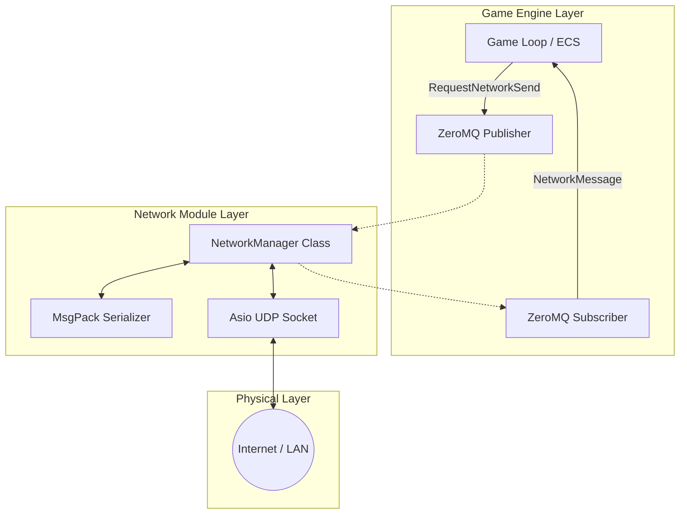
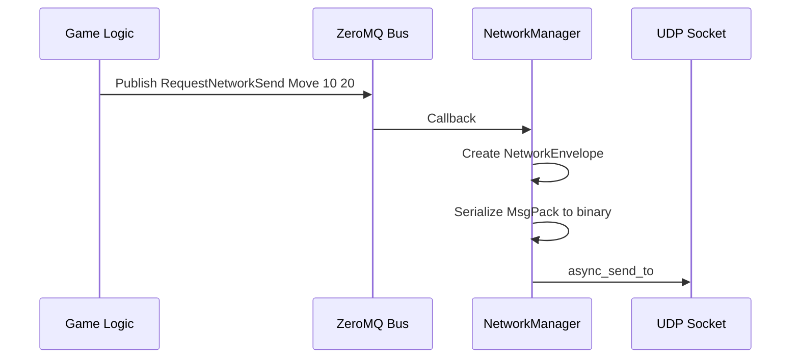
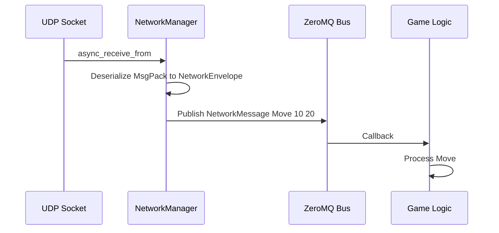

# 🌐 NetworkManager Architecture


The **NetworkManager** module is the backbone of the R-Type project communications. It ensures fast, asynchronous data transport between the Server and Clients.

> **Important:** The NetworkManager is a **pure network abstraction** - it handles sockets only, with NO client/server game logic. Game logic (lobbies, player management, game state) must be implemented in a separate layer.

---

## 📑 Table of Contents

1. [Why UDP?](#1-why-udp)
2. [System Architecture](#2-system-architecture)
3. [Data Flow](#3-data-flow)
4. [Technical Specifications](#4-technical-specifications)
5. [API Reference](#5-api-reference)
6. [Roadmap & Limitations](#6-roadmap--limitations)

---

## 1. Why UDP?

In accordance with real-time video game standards and project specifications, we use **UDP** instead of TCP.

| Feature | TCP (Transmission Control Protocol) 🐢 | UDP (User Datagram Protocol) 🚀 |
| :--- | :--- | :--- |
| **Concept** | Phone Call ("Hello? Can you hear me?") | Sending Postcards (Fire & Forget) |
| **Guarantee** | **Reliable** (Order and delivery guaranteed) | **Unreliable** (Loss and disorder possible) |
| **Speed** | Slow (Handshake, ACK, congestion control) | **Maximum** (No waiting) |
| **R-Type Usage** | Chat, Login, Level Loading | **Movement, Shooting, Health, States** |

> [!IMPORTANT]
> **Real-Time Philosophy:** It is better to lose a packet containing the player's position from 50ms ago than to freeze the game to recover it. The next position (arriving in 16ms) is more important.

---

## 2. System Architecture

The system relies on a layered architecture to decouple game logic from pure networking.



---

## 3. Data Flow

Here is the complete lifecycle of a packet, from emission to reception.

### 📤 Outbound (Sending)



### 📥 Inbound (Receiving)



---

## 4. Technical Specifications

### Packet Structure (Wire Format)
Thanks to UDP, a received packet is always complete. We use **MsgPack** to encode data.

| Component | Type | Description |
| :--- | :--- | :--- |
| **Topic** | `String` | The message subject (e.g., "PlayerMove", "GameStart"). |
| **Payload** | `String` | The raw data of the message (can be JSON, text, or binary). |

### ZeroMQ Commands (Internal API)

| Command | Arguments | Description |
| :--- | :--- | :--- |
| `RequestNetworkBind` | `Port` (e.g., "4242") | Opens the server to listen on the given port. |
| `RequestNetworkConnect` | `IP Port` (e.g., "127.0.0.1 4242") | Connects the client to a target address. |
| `RequestNetworkSend` | `Topic Payload` | Sends a message to the last known target. |
| `NetworkStatus` | `Message` | (Event) Notifies of a state change (Bound, Connected). |
| `RequestNetworkDisconnect` | - | Close socket and disconnect. |

---

## 5. API Reference

### ZeroMQ Topics (Commands)

| Topic | Payload | Description |
| :--- | :--- | :--- |
| `RequestNetworkBind` | `port` | Open UDP socket on specified port (server mode) |
| `RequestNetworkConnect` | `ip port` | Connect to remote endpoint (client mode) |
| `RequestNetworkSend` | `topic payload` | Send message with topic to remote |
| `RequestNetworkDisconnect` | - | Close socket |

### ZeroMQ Topics (Events)

| Topic | Payload | Description |
| :--- | :--- | :--- |
| `NetworkStatus` | `Ready\|Bound:port\|Connected:ip:port` | Connection state changes |
| `NetworkError` | `ErrorType:details` | Error notifications |
| `NetworkMessage` | `payload` | Incoming network data (topic from wire) |

### C++ Interface (INetworkManager)

```cpp
struct NetworkEnvelope {
    std::string topic;
    std::string payload;
};

class INetworkManager {
    virtual void bind(uint16_t port) = 0;
    virtual void connect(const std::string& host, uint16_t port) = 0;
    virtual void disconnect() = 0;
    virtual void sendNetworkMessage(const std::string& topic, const std::string& payload) = 0;

    virtual std::optional<NetworkEnvelope> getFirstMessage() = 0;  // Pop oldest
    virtual std::optional<NetworkEnvelope> getLastMessage() = 0;   // Pop newest
    virtual std::vector<NetworkEnvelope> getAllMessages() = 0;     // Drain queue
};
```

---

## 6. Roadmap & Limitations

The current implementation is a **v1.0 (Prototype)**. It is functional for 1v1 but requires evolution for the final version.

### 🚧 Current Limitations

*   **Single-Target (Last Speaker Rule):** The server only replies to the *last* client that spoke to it. There is no client list.
*   **Zero Reliability:** If a packet is lost, it is gone. No retransmission.

### 🗺️ Development Plan (Next Steps)

#### A. Multi-Client Management (High Priority)

- [ ] Create a `ClientSession` structure (ID, Endpoint, LastActivity).
- [ ] Maintain a `std::map<ClientID, ClientSession>` on the server side.
- [ ] Modify the API to target a player: `RequestNetworkSendTo "ClientID Payload"`.
- [ ] Add Broadcast: `RequestNetworkBroadcast "Payload"`.

#### B. Reliability Layer

For critical messages (*Game Start*, *Player Death*U), we cannot afford loss.
- [ ] Add a **Sequence ID** in the packet header.
- [ ] Implement an **ACK** (Acknowledgment) system.
- [ ] Create a buffer of "Messages waiting for ACK" to retransmit after `x` ms.

#### C. Connection Maintenance

- [ ] **Heartbeat:** Send a ping every second.
- [ ] **Timeout:** Disconnect a client silent for 5 seconds.

> [!TIP]
> For the reliability layer, no need to reinvent TCP. Look at the protocol used by *Quake 3* or the *Enet* library for inspiration.

---

## 7. Testing

### Unit Tests

```bash
cd build && ./NetworkManagerTests
```

### Integration Test Pattern

**Terminal 1 (Server):**

```bash
./build/rtype server 6543
```

**Terminal 2 (Client):**

```bash
./build/rtype client 127.0.0.1 6543
```

The server should print incoming `NetworkMessage` events from the client.